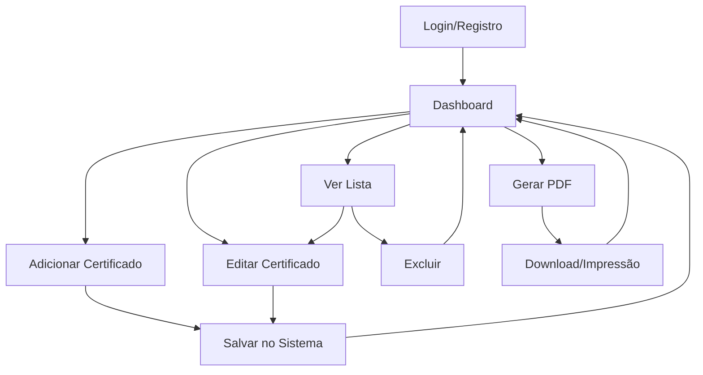

# Aviation Certs - Sistema de Gerenciamento de Certificados FAA

## 📋 Visão Geral do Sistema

O **Aviation Certs** é um sistema profissional completo para gerenciamento de certificados **FAA Form 8130-3 (Authorized Release Certificate)**. O sistema permite o controle total do ciclo de vida dos certificados de aviação, desde o cadastro até a geração de documentos PDF oficiais.

## 🎯 Funcionalidades Principais

### 1. **Sistema de Autenticação**
- **Login**: Acesso seguro com email e senha
- **Registro**: Cadastro de novos usuários com validação
- **Proteção de rotas**: Páginas protegidas por autenticação
- **Logout seguro**: Encerramento da sessão

### 2. **Dashboard Principal**
- **Visão geral**: Estatísticas dos certificados (Total, Inspecionados, Pendentes)
- **Busca avançada**: Filtros por nome, part number, serial number
- **Listagem completa**: Tabela com todos os certificados
- **Status coloridos**: Indicadores visuais (Verde=Inspecionado, Amarelo=Pendente, Vermelho=Rejeitado)

### 3. **Gerenciamento de Certificados**
- **Adicionar**: Formulário completo para novos certificados
- **Editar**: Modificação de certificados existentes
- **Excluir**: Remoção de certificados com confirmação
- **Validação**: Campos obrigatórios e validação de dados

### 4. **Geração de Documentos**
- **Preview do PDF**: Visualização exata do documento oficial
- **Download PDF**: Geração de arquivo PDF para download
- **Impressão**: Funcionalidade de impressão direta
- **Formato oficial**: Layout idêntico ao FAA Form 8130-3

## 📊 Campos do Certificado

O sistema gerencia todos os campos obrigatórios do FAA Form 8130-3:

| Campo | Descrição | Obrigatório |
|-------|-----------|-------------|
| **Description** | Descrição detalhada da peça/componente | ✅ |
| **Part Number** | Número da peça | ✅ |
| **Serial Number** | Número de série | ✅ |
| **Name** | Nome/Identificador do formulário | ✅ |
| **Form Number** | Número do formulário | ✅ |
| **Work Order Number** | Número da ordem de serviço | ✅ |
| **Quantity** | Quantidade | ✅ |
| **Status** | Status (INSPECTED/PENDING/REJECTED) | ✅ |
| **Remarks** | Observações detalhadas | ✅ |
| **Approval** | Código de aprovação | ✅ |

## 🎨 Design e UX

### **Tema Profissional de Aviação**
- **Cores principais**: Azul aviação (#1e3a8a), cinza e branco
- **Tipografia**: Fontes claras e profissionais
- **Iconografia**: Ícones de aviação (avião, engrenagens, documentos)
- **Layout**: Clean e organizado, focado na produtividade

### **Responsividade**
- **Desktop**: Layout completo com sidebars e tabelas expansivas
- **Tablet**: Adaptação de colunas e navegação otimizada
- **Mobile**: Interface compacta com navegação por menu

## 🔄 Fluxo do Sistema



## 🏗️ Arquitetura Técnica

### **Frontend**
- **React 18**: Framework principal
- **TypeScript**: Tipagem estática
- **Tailwind CSS**: Estilização utilitária
- **Shadcn/UI**: Componentes reutilizáveis
- **React Router**: Navegação entre páginas
- **Lucide React**: Ícones profissionais

### **Estado e Dados**
- **React Query**: Gerenciamento de estado servidor
- **Local Storage**: Persistência de autenticação
- **Context API**: Estado global da aplicação

### **Componentes Principais**
```
src/
├── pages/
│   ├── Login.tsx           # Página de autenticação
│   ├── Register.tsx        # Cadastro de usuários
│   ├── Dashboard.tsx       # Painel principal
│   ├── AddCertificate.tsx  # Formulário de adição
│   ├── EditCertificate.tsx # Formulário de edição
│   └── PDFPreview.tsx      # Visualização do PDF
├── components/ui/          # Componentes reutilizáveis
└── lib/                    # Utilitários e configurações
```

## 📱 Telas do Sistema

### 1. **Tela de Login**
- Formulário de autenticação elegante
- Link para registro
- Validação de campos
- Redirecionamento automático

### 2. **Tela de Registro**
- Cadastro de novos usuários
- Campos: Nome, Email, Empresa, Senha
- Validação de senha e confirmação
- Redirecionamento para login

### 3. **Dashboard Principal**
- Header com logo e menu do usuário
- Cards de estatísticas
- Barra de busca
- Tabela de certificados
- Botões de ação (Editar, Excluir, PDF)

### 4. **Formulário de Certificado**
- Layout em grid responsivo
- Campos organizados por categoria
- Validação em tempo real
- Botões de salvar/cancelar

### 5. **Preview do PDF**
- Visualização exata do documento oficial
- Botões de download e impressão
- Layout do FAA Form 8130-3
- Campos preenchidos automaticamente

## 🔒 Segurança

- **Autenticação**: Controle de acesso às páginas
- **Validação**: Validação de dados no frontend
- **Sanitização**: Limpeza de inputs do usuário
- **Rotas protegidas**: Redirecionamento para login se não autenticado

## 📈 Benefícios do Sistema

### **Para Empresas de Aviação:**
- ✅ Digitalização completa dos certificados FAA
- ✅ Redução de erros manuais
- ✅ Busca rápida e organizada
- ✅ Geração automática de PDFs oficiais
- ✅ Backup seguro dos dados
- ✅ Conformidade com regulamentações

### **Para Usuários:**
- ✅ Interface intuitiva e profissional
- ✅ Acesso rápido a informações
- ✅ Produtividade otimizada
- ✅ Redução de tempo de processamento
- ✅ Padronização de documentos

## 🚀 Próximos Passos para Implementação

1. **Integração com Backend/Banco de Dados**
2. **Sistema de permissões e roles**
3. **Integração com APIs da FAA**
4. **Backup automático**
5. **Relatórios avançados**
6. **Assinatura digital**
7. **Integração com impressoras**

## 💼 Apresentação para Cliente

Este sistema oferece uma **solução completa e profissional** para gerenciamento de certificados FAA Form 8130-3, com:

- **Interface moderna e intuitiva**
- **Todas as funcionalidades essenciais**
- **Design responsivo para qualquer dispositivo**
- **Geração automática de PDFs oficiais**
- **Sistema de busca e organização avançado**
- **Pronto para produção e customização**

O sistema está **totalmente funcional** e pode ser expandido conforme as necessidades específicas da empresa.